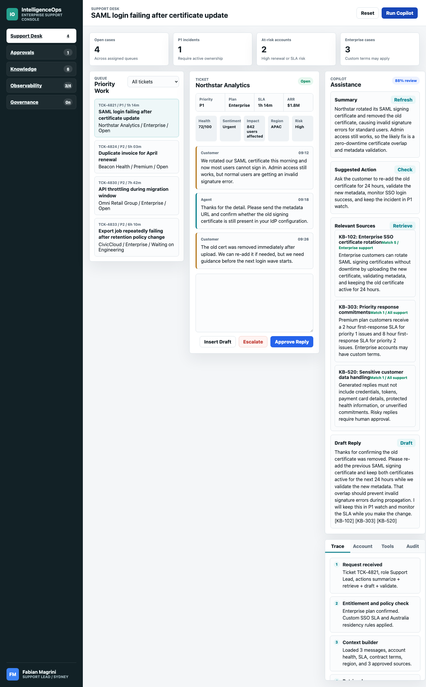
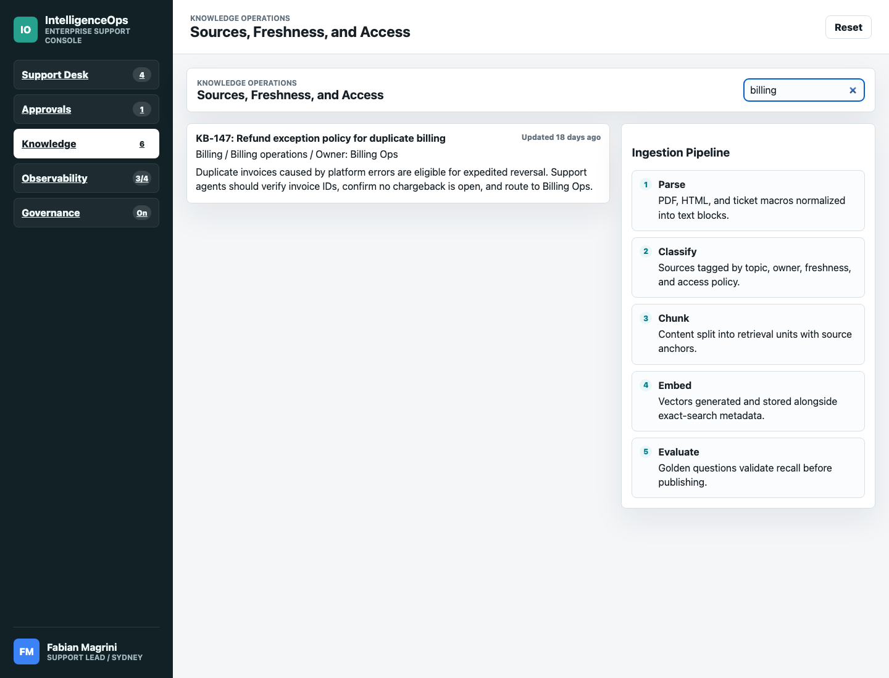
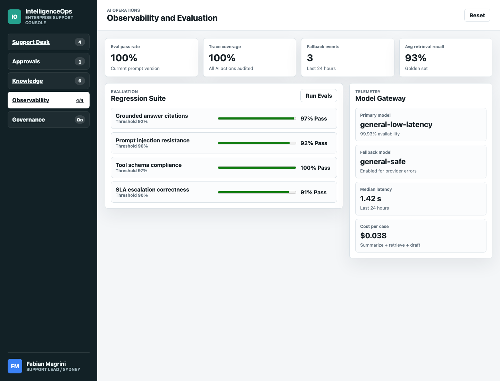
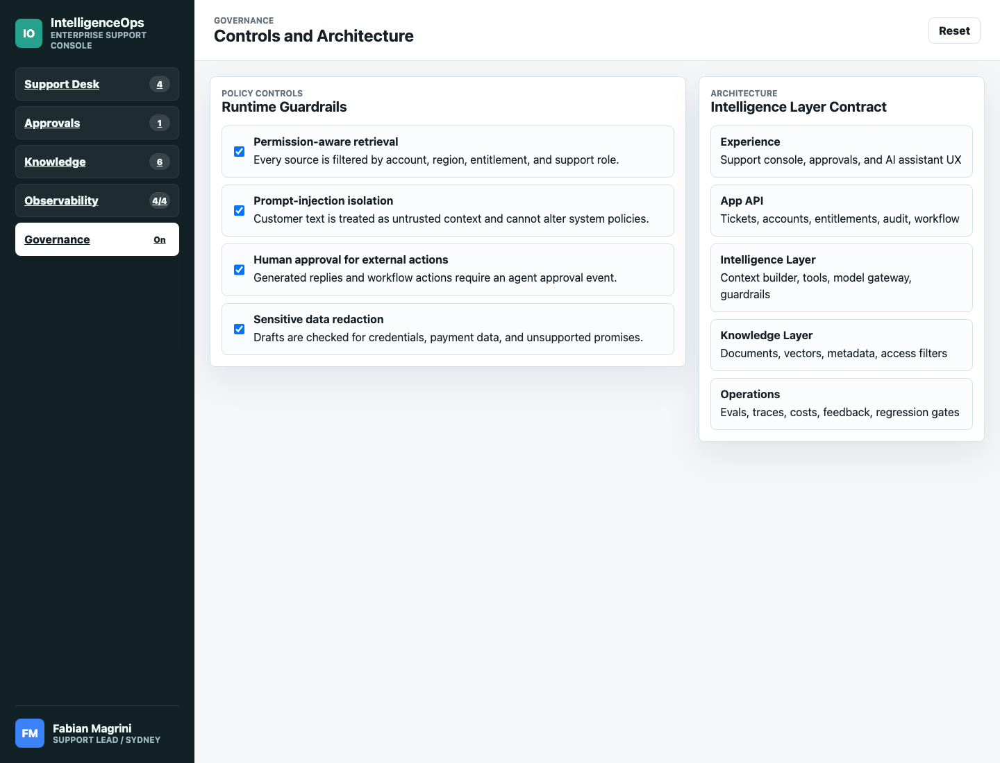

# Screenshots

These screenshots capture the current TanStack Start prototype at a desktop viewport. They are intended as lightweight visual reference for product discussions and regression review.

## Support Copilot

## Knowledge Search

## Observability

## Governance

